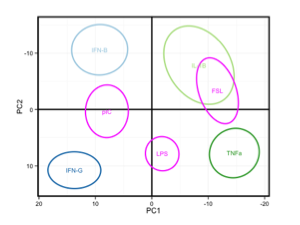
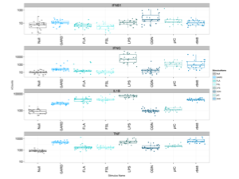
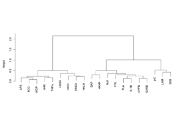
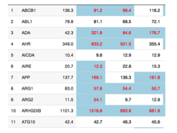

# Web application instructions

On this page, additional information is provided on each of the visualization applications. For each view, we discuss the methods used for data representation and the available options to explore the entire dataset on your own.

***
## PCA View Panel

 <table border="3" style="width:100%">
  <tr>
    <td></td>
    <td>

This panel allows the exploration of different transcriptomics signatures using a Principal Component Analysis (PCA) approach. Prior to PCA, values for each of the 572 mRNAs were first normalized using housekeeping genes, log2 transformed, centered to a mean value of zero across each donor, and scaled to unit variance (see methods section in the article for more details).

### Plots

* **PCA scatterplot PC1 vs PC2**: this scatterplot shows the first 2 components of the computed PCA. Each ellipse represents the 95% confidence for each stimuli response, across the 25 donors. When the color of the ellipse is depicted in purple, it means that the stimuli is projected into the space without contributing the the PCA analysis.
* **PCA scatterplot PC1 vs PC3**: this scatterplot shows the first and third components of the computed PCA. Each ellipse represents the 95% confidence for each stimuli response, across the 25 donors. When the color of the ellipse is depicted in purple, it means that the stimuli is  projected into the space without contributing the the PCA analysis.
* For additional information, please refer to the manuscript and the associated method section. 
Preset projections from the manuscript (top right buttons: Fig1B, F1......) are meant to help you get started.

### Control widgets

* **PCA stimuli space**: this drop-down menu allows you to select between the PCA space built from the 4 cytokines stimuli (IL-1B, IFNB, IFNG, TNFa), or the 7 TLRs stimuli (FSL, pIC, LPS, FLA, GARD, R848, ODN).
* **Projected Stimuli**: this multi-choice menu provides the option to project multiple stimuli into the PCA space built from the 4 cytokines, or 7 TLRs. A projected stimulus does not contribute to the PCA computation.
* **Preset genes**: this drop-down menu offers two gene lists (44 genes or 572 genes)
* **Gene list**: this multiple-choice menu lists all the genes that are used for the PCA computation. It is synchronised with the Present gene menu, however a total freedom to remove, or add, genes is allowed. After each gene deletion, or insertion, the PCA computation is updated accordingly. 

</td>
</tr>
</table> 

***

## Boxplot View Panel

 <table border="3" style="width:100%">
  <tr>
    <td></td>
    <td>
This panel uses a box-whisker Tukey plot to explore the levels of gene expression across different stimuli. Individual donor expressions are overlayed as dots. The nCount data presented has been normalized using housekeeping genes (see methods section in the article for more details).

### Plot

* **Boxplot**: each boxplot, using the box-whisker Tukey representation, depicts the expression of a given gene across the different selected stimuli. Individual measurements are overlayed as dots. In case of multiple gene selected, plots are stacked on top of each other. Measurements are reported as normalized nCounts (NanoString Technologies).
* For additional information, please refer to the manuscript and the associated method section. 
Preset projections from the manuscript (top right buttons: Fig1B, F1......) are meant to help you get started.

### Control widgets
* **Selected stimuli**: this multiple choice box offers the possibility to choose the stimuli of interest. The order of the selection is also the order used for the boxplot representation.
* **Selected mRNAs**: this multiple choice box allows you to select the mRNAs of interest. Currently a maximum list of 5 is allowed.
* **Compact plot**: this checkbox enables a more compact view of the stacked boxplots to facilate comparisons.
* **Download**: this button allows you to save the current plot on your local drive as an image file.
</td>
</tr>
</table>

***

## Correlations View Panel

 <table border="3" style="width:100%">
  <tr>
    <td>

    </td>
    <td>

This panel shows correlations among stimulus-induced genes. Gene expression data from all 23 stimulation conditions were used to generate Spearman correlation matrices and hierarchical cluster analysis. For this analysis, a stimulus is considered if the associated gene is differentially expressed as compared to Null condition (paired t-test, q-value < 0.001), and the median fold change is greater than 2.  

### Plots

* **Dendogram representation**: this representation depicts the hierarchical clustering analysis based on Spearman correlation across all 25 donors for a given gene.
* **Correlation matrix**: this color-coded correlation matrix shows the Spearman correlation score between each selected pair of stimuli.  
* For additional information, please refer to the manuscript and the associated method section. 

### Control widgets

* **Select mRNA**: this drop-down menu allows to select the mRNA of interest, across the 572 available in our dataset. In case the selected mRNA has no stimulus satisfying the induction criteria described above, an error message will be displayed.
</td>
</tr>
</table>

***

## Reference Table View Panel

 <table border="3" style="width:100%">
  <tr>
    <td>

    </td>
    <td>

This panel offers the ability to browse all the reference values representing  the measured inflammatory response across our 25 healthy donors.

### Interactive Table

* **Reference Values**: this interactive table shows all the reference values, across stimuli, according to the metric selected (as indicated in the 'Reference Value' drop down list). The stimuli conditions displayed are also customizable. At the top of each column, a filter on value can be used to narrow down your search. All 572 genes are browsable following the pagination system at the bottom of the table.
* **Download**: at the bottom of the table, a download button is available to save the current table, as a CSV file, on your local disk.

### Control widgets

* **Reference Value**: this drop-down menu is used to select the metric used for the data displayed. 4 options are available: Median expression, Median fold change, Coefficient of variation (CV), and q-value from a paired t-test with the Null condition.
* **Select stimuli of interest**: this multi-choice box offers the ability to select the stimuli to display as columns in the table.
* **Highlight cells**: this numeric box defines the q-value cut-off threshold (in the context of a paired t-test with the Null condition). When the data reaches a statistcaly significant, according to the specified qValue cut-off, the corresponding cells will be highlighted across all the different metrics available. This way one can highlight values that only relates to significant expression change compared to Null.
</td>
</tr>
</table>
