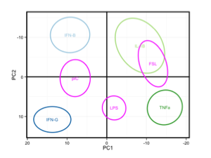
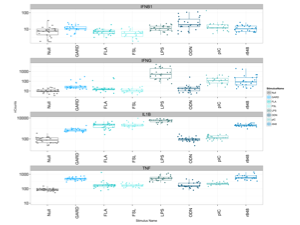
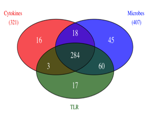
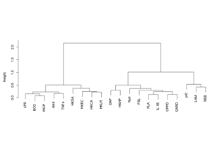
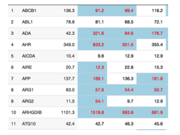

## Article abstract

"Systems approaches for the study of immune signaling pathways have been traditionally based on selected purified cell types or cultured cell lines. However, in vivo responses involve the coordinated action of multiple cell types, which interact to establish an inflammatory microenvironment. Here, we employed standardized whole-blood stimulation systems to determine the transcriptional responses to key cytokines, an array of Toll-like receptor ligands and whole microbes. The integration of these results allowed us to define the contributions of the effector cytokines to the responses to complex stimuli. This dataset presented with an interactive online analytical interface, provides healthy donor reference values for induced inflammatory genes, while being immediately and fully accessible to the community. In addition the analytical approaches described provide a strategy for deconvoluting cytokine responses and characterizing novel immunomodulatory molecules, in turn helping to identify new applications for therapeutic inhibition of selected cytokine pathways."

## Interactive application 

 <table border="1" style="width:100%">
  <tr><td align="center"></td>
      <td align="center"></td>
      <td align="center"></td></tr>
   <tr><td align="center"></td>
      <td align="center"></td>
    <td align="center"></td>
    </tr>
    </table>
    
This interactive web application is provided as a companion application to the article **"Standardized whole-blood transcriptional profiling enables the deconvolution of complex induced immune responses"**, *by Urrutia et al.*. Through different visualization panels, the entire transcriptomics dataset presented in the article can be explored. Hot keys within the application allow you to replicate many of the figures presented in the paper. With this Shiny App we invite you to run your own data mining queries. Moreover, it is our hope that this interactive presentation will provide easy access to reference values for induced inflammatory genes.

Each visualization panels provide a distinct perspective on the dataset presented:

* the **PCA View:** the transcriptomics response from each stimuli can be explored within a PCA-based space built based on 4 cytokines signatures (IL-1B, IFNB, IFNG, TNFa), or 7 TLRs signatures (FSL, pIC, LPS, FLA, GARD, R848, ODN).
* the **Boxplot View:** the expression of each of the 572 genes screened can be visualized across all stimuli.
* the **Correlation View:** for each gene, a hierachical clustering is built on Spearman correlation scores across stimuli in order to evaluate common variance patterns. 
* the **Reference Values Table View:** an interactive table presents reference values for the inflammatory response genes. Median expression value, coefficient of variation, q-value from paired t-test are available.

We would love to hear from your experience with this application. Do not hesitate to share your comments and your ideas on how to make it better. Contact us at milieuinterieurconsortium@pasteur.fr

Additional information about each of the view can be found in the tab panel called **Instructions**.
